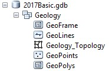
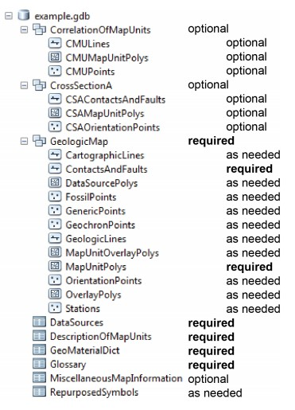

# Data management goals at NBMG
---
## Principles
Our data management strategy will ensure that data are:

**High-quality**
-   Define and apply quality assurance and quality control procedures for all
    data to ensure data quality and integrity

-   Create a single point of truth for data housed within NBMG

**Reproducible and Well-described**
-   Provide high-quality descriptive metadata for all datasets

-   Data and services should be described well enough to be used without expert
    assistance

**Accessible and Discoverable**
-   Data and metadata should be available and searchable on the web

-   Disseminate data to the public and scientific community in user-friendly web
    portals

**Secure**
-   Build access and management systems to ensure data security

-   Ensure that sensitive data are protected accordingly and data are only
    available to appropriate users

**Preserved**
-   Maintain edit and versioning history for all data within the system

-   Data should be available and understandable – if the data owner leaves the
    department, others should still be able to retrieve and understand what the
    data are and how they were created

-   Personal and research data that are not actively being used or accessed
    should be archived in the appropriate location, whether in University hosted
    cloud (Nevada Box) or through library services

**Compliant**
-   Compliant with data standards or grant requirements when Open Geospatial
    Consortium (OGC) and Geoscience Markup Language (GeoSciML)

-   Structurally and semantically interoperable with industry standards

Data management practices should promote:

**Maintainability**
-   Long-term costs should be minimized by using open-source software when
    possible

-   Any tools or software created should be versioned and documented so that
    others could maintain it in the future

-   Newly implemented systems should strive to be as simple as possible while
    still being

**Sustainable and reproducible workflows**
-   Create data workflows for adding to existing datasets and quickly making
    data available online

-   Allow multiple users to simultaneously access and edit GIS data in-house

-   Create input portals to facilitate data submission to NBMG

**Redundancy and reliability**
-   All data on server should be backed up, back-ups will be customized
    depending on data IO

-   In-house server uptime for file shares is a priority

## Types of Data
### Tabular
Quick reference:
- Tabular data should be stored in a relational format whenever possible, and preferably in a relational database management system
- Column names should be descriptive
-	File names should be descriptive and include a date
-	Data should favor row-wise additions rather than adding columns
-	Data should be stored in non-proprietary formats for longevity and accessibility

Reference: [National Center for Ecological Analysis and Synthesis Data Management Primer](https://www.nceas.ucsb.edu/files/0012-9623-90%252E2%252E205.pdf)

Long term data should be stored in a relational database management system. Research data should be stored in the appropriate location on the NBMG file system (see outline here: https://nbmg-unr.github.io/file_system.html). The data on the file system may eventually be integrated into the relational system, so be sure to store data in the correct location for discoverability.  

### GIS Data
NBMG currently uses the following folder structure for mapping projects, which encompasses any data that are used in the map (geodatabase, images, layers, shapefiles), documentation and metadata associated with the project, and

- publication number
  - data
    - geodatabase (Contains the ESRI geodatabase files for the map)
    - images (Contains different types of images)
        - georeferenced (Georeferenced map that was converted to GIS)
        - original (Contains the original map)
    - Layers (ESRI ArcGIS layer files of each layer in the table of contents of the ArcMap MXD file)
    - shapefiles (ESRI shape files for each layer in the ArcMap table of contents of the ArcMap MXD file)
  - docs (contains the text document to accompany map)
    - metadata (contains the metadata as a text file (.txt)for:
      - Geodatabase
      - FeatureDataSet
      - Each FeatureClass in the Geology FeatureDataSet
  - maps (contains the final ESRI ArcGIS 10.3.1 ArcMap MXD file)
  - pdfs (contains the final PDF files of the map plates, text, original map, mxd)

The following geodatabase structure is the NBMG standard for organizing geologic features.

NBMG is mandated be partially compliant with USGS’s geologic map schema (GeMS) by 2020, and must fully adopt the schema by StateMap deliverables in 2022.

The GeMS schema is more complex than NBMG’s model, but is to be used as a publication or archival format for the database only, agnostic of visual presentation. Thus, NBMG’s long term plan is to develop a toolbox and workflows to convert NBMG’s geodatabase schema to the GeMS schema after the mapmaking process is complete.
