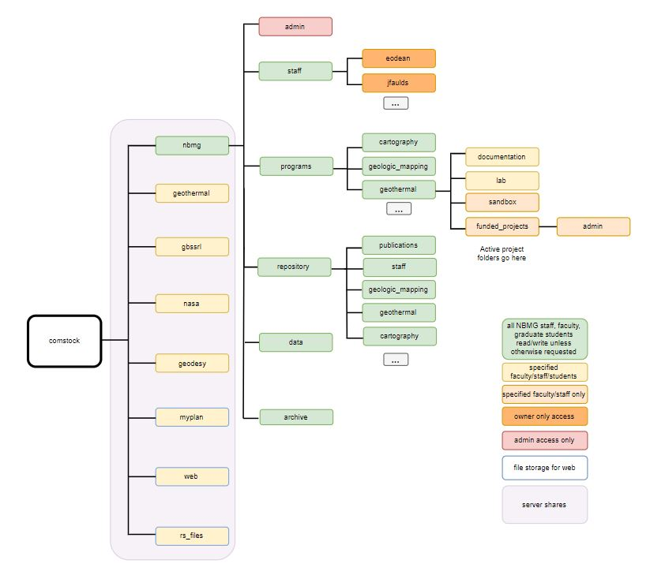

# Managing your personal and shared data on Comstock
---

## Outline -- New structure

Note: **[]** designates a folder

- **[staff]** - contains documents that are work-related and not being actively shared with or collaborated on with other faculty for the time being. These will only be accessible by you.
  - _Access_: Owner of the folder only unless otherwise specified
  - _Size limit_: 30Gb per user. Please see below for other free storage solutions provided by UNR if your amount of personal data exceeds this limit.
  - _Description_: Your user folder should be in the form of first initial and last name, all lowercase and no spaces
    - e.g. Emily ODean would be [eodean]
- **[programs]** - contains program-based folders that include active data and projects.
  - _Access_: top level folder accessible by all. Access restrictions on subfolders.
  - _Description_: Projects and data in these folders should be actively in-use. Projects don&#39;t necessarily need to be actively being worked on by more than one user at a time – this is just a space for any NBMG projects that benefit from having shared visibility.
  - _Subfolder structure_:
    - [program\_name] (e.g. [cartography], [hazards], [geologic\_mapping])
      - **EXAMPLE subfolder structure per program below. Program subfolder structure will be determined by one key personnel from each program.**
      - [documentation] – Any documentation for the workflows for the program.
      - [lab] - Folder for permitted students to collaborate with their program.
      - [sandbox] - Folder for development and staging projects that may need tighter access restrictions than other areas.
      - [funded\_projects]– Folder for current research projects
        - [admin] - Folder for funding info and proposals related to the project. Will likely have tighter security mechanisms in place than the top level [funded\_projects] folder.
- **[repository]** - contains all data and documents that belong to or are useful to NBMG but are not actively being modified. Projects from [programs] should be moved to the matching subfolder in [repository] once the files are no longer being modified. These are data that might need to be searched or referenced and would be useful to have in an accessible location (as opposed to data which will not need to be accessed for some time, which should be placed in [archive]).
  - _Access_: top level folder accessible by all. Access restrictions on subfolders matching those in [programs].
  - _Description_: Move data that are no longer being edited to this folder. Note that this folder will remain on the network drive but in &quot;cold storage,&quot; which is slower (though just the same speed as our current server) and cheaper for us. This folder has the same overall subfolder structure as the [programs] folder, with the addition of the [publications] folder and a [staff] folder. Note that the [staff] folders will have the same restrictions and privacy as the main level storage. The [staff] folder in repository may include grant documents, older versions of files, old curriculum plans, etc - but it should not include datasets for projects. These should be put in a topic-based folder under [program].
- **[administration]** - HR documents and similar.
  - _Access_: Only admins
- **[data]** (formerly nevada\_data)
  - _Access_: read only to all staff and permitted students. Write access to permitted faculty and staff.
  - _Subfolder structure_: [GIS] and [other]

- **[archive]** – this is for data and documents that no longer need to reside on the network share, and do not need to be accessed for the foreseeable future, but have some value in being retained.
  - _Access_: all N: drive users
  - _Note_: This folder will be programmatically uploaded to NBMG&#39;s Nevada Box cloud storage once per month, and a datestamp will be added to the file name before upload to ensure all versions of documents are saved. If you have sensitive data that need to be archived directly from their protective folder, please email the data manager directly [eodean@unr.edu](mailto:eodean@unr.edu).

 

## What should go on Comstock (and what shouldn&#39;t)

The purpose of our shared file server is to house any &quot;enterprise&quot; data, and this storage is paid for by NBMG. This includes:

- Projects, data, photos, and documents that you and colleagues are actively collaborating on and are related to your work at NBMG
- Final versions of research datasets and analyses (what you would archive at the end of a project)
- Any data and files that are relevant to NBMG as an organization and not only to you personally

Examples of items that **shouldn&#39;t** be on our file system

- Personal documents unrelated to your work and NBMG
- Articles or photos that you might want to share with a colleague, but aren&#39;t proprietary to NBMG (Want to share items with colleagues? Try sharing via Nevada Box, or a tool such as Mendeley for articles)
- Any executables, drivers, or any software
- Your personal music, videos, photos, schoolwork, etc…
- Back up of your personal computer

Examples of items that **should** be on our file system

- Data that you&#39;ve created that are related to your work at NBMG (including in-progress)
- Course materials that you&#39;ve created
- Lab resources and documents
- All elements of research projects – grant proposals, data management plans, data, metadata, scripts and code, products

Sometimes these lines can get blurred, so use your best judgement.

## Instructions for migrating to the new system

Move all of your personal data to the new structure outlined above, which is all currently housed within &quot;\_1new\_structure&quot; (FYI – we will NOT be using underscores and numbers to get folders to the top of the file system in the future).

**Before you move anything, open up all your .mxd&#39;s that you are moving and make sure that you are using relative instead of absolute file paths.** Remember, this will only work if all target layers are moved relative to the .mxd. There will inevitably be some broken links in the short term, however, keeping relative file paths enabled after repairing the links to the new target locations should mitigate future breaks.

1. Create a personal folder for yourself under /\_1new\_structure/staff using your first initial and last name, all lowercase (e.g. &quot;/\_1new\_structure/staff/eodean&quot;). Move your personal data which may be scattered about Comstock into this folder.
  1. As you are moving data, note if there are any files and documents that do not belong on our network storage system, and see if you can either transition them to Nevada box, OneDrive, or the University storage share (/storage/)
  2. If you need to archive any old versions of files or data that are not in active use, put them under the new &quot;/\_1new\_structure/archive&quot; folder. Follow the guidelines listed above, using descriptive top-level folder names and include metadata. Also consider moving completed research data and projects to the &quot;repository&quot; folder for projects that are not active.
2. If you&#39;ve been using documents or data in other user&#39;s folders, then these documents need to be moved to a communal space in [programs] or [repository].
3. As you&#39;re moving your documents and folders, consider renaming and organizing your internal folder structures and doing some metadata inventory. Don&#39;t worry about renaming all old files to use the new conventions, but moving forward, try to use the outlined conventions for consistency.
4. Back up your personal computer to Box or OneDrive (see section below on backing up your personal computer). Remove all of this data from the shared drive.
5. If you are in charge of a program, create a program folder under [programs] using the folder naming conventions below. Consider using the subfolder system outlined above ([documentation], [lab], [sandbox], [funded\_projects]. Name any additional subfolders using the naming guidelines below.
  1. If you have created a folder for your program, please reach out to me at [eodean@unr.edu](mailto:eodean@unr.edu) and let me know what access mechanisms to employ (who should have access to which subfolders).

Please begin this process NOW, and try to complete it by **JUNE 30**. Much of this migration may require coordination with colleagues if you have been working in others&#39; personal folders.

On July 1, I will archive old staff folders and move appropriate data to the [repository], [data], and [archive] folders.

## Adding files and projects to the [repository] and [archive] folders

What&#39;s the difference between the [repository] and [archive] folder in the new structure?

- **[repository]** data will stay on the network drive. This is for data, projects, and documents that still need to be accessed and need to be searchable by those within NBMG. This applies to any maps, data, and projects that are in a complete state but still need to be referenced and accessed. This folder has the same substructure as the [programs] folder so files can be easily found.
  - **[repository]** is also a place for faculty and staff to put their completed research documents, including publications, data, scripts, grant proposals, etc. when you have completed your research projects. Put these in the [funded\_projects] subfolder, similarly to where your working documents resided in programs/…/funded\_projects.
- **[archive]** data will be uploaded to NBMG&#39;s Nevada Box cloud storage once per month. This is data that you do not think you will need to access in the foreseeable future. Old staff folders, ancient presentations or grant proposals, and any other items relevant to NBMG but not in-use should be moved here.

When adding folders to [archive] or to [repository], please name the top level folder descriptively and using the conventions described above. Please also include metadata with all data and code.  Final archive-eligible datasets should include complete and highly descriptive metadata. Please refer to [this template](https://prd-wret.s3-us-west-2.amazonaws.com/assets/palladium/production/s3fs-public/atoms/files/MetadataQuestionnaire.pdf) for the type of information that should be included.

Ultimately, NBMG research data and projects will be moved to a more structured online searchable repository, where data will either be designated as public or private. Complete metadata is the key to data being searchable and discoverable. Writing and associating complete metadata with your collected data will save you lots of time and pain later on!

## Back up your computer - OneDrive or Box

**Your personal computer should not be backed up to our network file server (Comstock).**

Back up your personal computer using Nevada Box or Microsoft OneDrive. We each get unlimited storage on Box and 5Tb of storage on OneDrive. You can set up to sync your important computer folders automatically.

[Sync your files to Box](https://oit.unr.edu/services-and-support/data-storage/nevadabox/nevadabox-apps/nevadabox-apps-university-computers-windows-only/)

[Sync your files to OneDrive](https://support.office.com/en-us/article/sync-your-documents-pictures-and-desktop-folders-with-onedrive-d61a7930-a6fb-4b95-b28a-6552e77c3057?ui=en-US&amp;rs=en-US&amp;ad=US)

Note that we also each get a small amount of storage on UNR&#39;s general purpose \\storage network share. Find out how to map to this network drive and store your personal files [here](https://oit.unr.edu/services-and-support/data-storage/network-data-storage/nas-personal-share/).

## Versioning your files

While it&#39;s valuable (and highly recommended!) to save multiple versions of your data and files as you make significant edits and additions, keep in mind that these multiply the storage footprint of your data.

To stay organized and conserve space, consider creating &quot;archive&quot; subfolders in your project folders. Move your old versions of data to this folder. When you are quite sure that you won&#39;t need to access the old versions again, either consider deleting interim versions, or move these documents to the cloud &quot;archive&quot; folder under [nbmg] \&gt; [archive]. An archival script will be run once a month and will archive these documents to NBMG&#39;s enterprise Nevada Box account.

## Folder and file naming conventions for the network drive

- When using date information, use the YYYYMMDD format over other formats
- Try to keep file and folder names less than 32 characters
- Include relevant information like unique identifiers, project name, grant numbers or research data names
- When using sequential numbering, make sure to use leading zeros to allow for multi-digit versions. For example, a sequence of 1-10 should be numbered 01-10; a sequence of 1-100 should be numbered 001-010-100
- No special characters: &amp; , \* % # ; \* ( ) ! @$ ^ ~ &#39; { } [] ? \&lt; \&gt; –
- Use only one period and before the file extension (e.g. name\_paper.doc and NOT name.paper.doc OR name\_paper..doc)
- Use underscores to separate words or dates
  -  &quot;clark\_map\_v1\_20130322.jpg&quot;
- When storing multiple versions of files as you make significant edits, include the date (and, perhaps, time) in the file name instead of using names like &quot;data\_final.csv,&quot; &quot;data\_final\_final.csv,&quot; &quot;data\_actuallyrealfinalone.csv.&quot; Keep an &quot;archive&quot; folder in the same folder as your current version of your dataset and move all of the older versions to this folder to stay organized.
