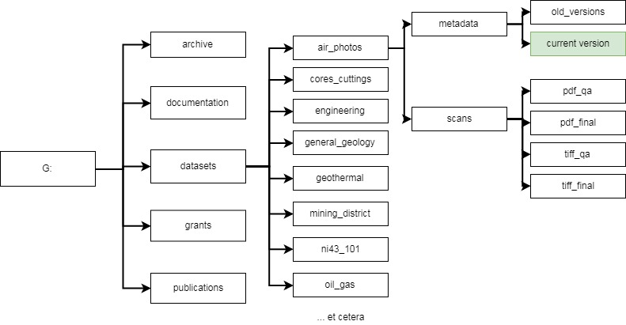

GBSSRL File Structure and Workflow Proposed Changes
===================================================

Objectives
----------

The G: drive ([\\\\nickel.unr.edu\\gbssrl](file:///\\nickel.unr.edu\gbssrl))
should host all electronic documents related to data that is hosted within
GBSSRL. Currently, some of this data is spread between the N: drive and the G:
drive. There are a number of duplicated PDFs between the G: drive and files used
for NBMG’s open data pages
([\\\\nickel.unr.edu\\web](file:///\\nickel.unr.edu\web)). Additionally, there
are many different versions of spreadsheets in various locations, so it is
difficult to find the most current version. Finally, using the G: drive as an
archive for large TIFFs is not an appropriate use of storage. Once TIFFs have
been converted to PDFs and have gone through adequate quality assurance
processes, the TIFFs should be migrated to “cold storage,” which is far less
costly than using network attached storage.

Proposed structure
------------------

### Archive

Once TIFFs have been converted to PDFs and both have been quality assured, move
the TIFFs over to the “archive” folder. The archive folder will have the same
structure as the “datasets” folder, so move the data accordingly.

### Documentation

All documentation pertaining to GBSSRL should go in this folder. This does not
include instructions directly related to data entry for any of the spreadsheets
in the “dataset” folder – instructions for a particular dataset should be kept
in that folder. General documentation should go in the “documentation” folder.

### Datasets

This folder should contain all spreadsheets and scanned data from GBSSRL. New
data folders and subfolders can be created, but be conservative so that
everything stays organized. Put all related scans and spreadsheets in each topic
based folder. Spreadsheets should go in the “metadata” folder. Only the most
current version of a spreadsheet should be placed in the top level “metadata”
folder. Older versions can be placed in the “old_versions” subfolder.

Scans should be put in the “scans” subfolder. Working scans should go in the
\_qa folders, and versions that have been qa’ed should go in the \_final
folders. Once scans are in the \_final folders, there should not be copies in
the \_qa folders. Final TIFs should be moved to the “archive” folder. If PDFs
are published on the web (in the
[\\\\nickel.unr.edu\\web](file:///\\nickel.unr.edu\web) folder), then PDF’s
should be removed from the pdf_final folder. Instead, put a link to the web
folder in which they are contained inside the pdf_final folder (right click -\>
new -\> shortcut -\> path to files). This is to save space on the server and
avoid duplication.

### Grants

All grant RFPs, proposals, and documentation should go in this folder. Each
grant should have its own subfolder within the top level folder.

### Publications

This folder will essentially be the same as the current “PublicationSales”
folder.
